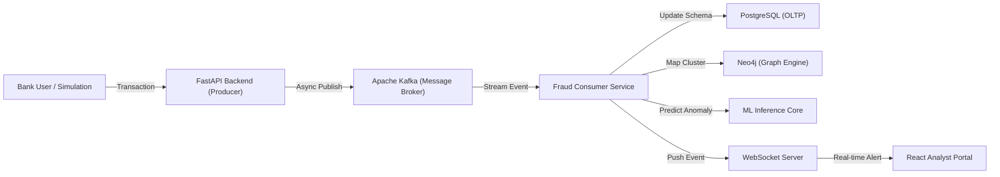

# MuleDNA: Advanced Mule Account Detection System
**A Multi-Layered Approach to Identifying Money Laundering & Smurfing Networks**

---

## 1. Problem Statement
### What are Mule Accounts?
A **Mule Account** is a bank account that is used by criminals to launder the proceeds of illegal activity. Unlike direct fraud where a criminal steals from an account, "Muling" involves moving "dirty" money through a chain of legitimate-looking accounts to obscure the original source of the funds.

### The Fraud Mechanism: Layering & Laundering
*   **Placement**: Illegal cash is converted into digital funds.
*   **Layering**: Funds are moved through dozens of "Mule" accounts across different banks and geographies.
*   **Integration**: The "cleaned" money is withdrawn or invested, appearing as legitimate income.

### Why Traditional Systems Fail
1.  **Transactional Silos**: Traditional systems look at a single transaction in isolation. They fail to see the *network* (the connection between Account A, B, and C).
2.  **Latency**: Batch-processing systems detect fraud hours or days after the money has already been withdrawn.
3.  **Synthetic Identity**: Criminals utilize "Money Mules" who are often real people (sometimes unwitting) with legitimate histories, making them invisible to standard KYC (Know Your Customer) filters.

---

## 2. Proposed Solution
**MuleDNA** is a real-time forensic platform designed specifically to uncover these hidden networks using a four-pillared approach:

*   **Behavioral Analysis**: Monitoring velocity (frequency) and "Rapid In-and-Out" patterns that deviate from normal retail banking behavior.
*   **Graph-Based Intelligence (Neo4j)**: Visualizing relationships not just between accounts, but between shared hardware (Device IDs) and network access points (IP Addresses) to find "Fraud Rings."
*   **Real-time Streaming (Apache Kafka)**: Processing every transaction event as it happens, allowing for sub-second interception.
*   **Ensemble Risk Scoring**: A composite score (0-100) calculated from rule-based engines and Machine Learning models (Isolation Forest) to provide a single "Risk Health" metric.

---

## 3. System Architecture
The MuleDNA architecture is designed for high-concurrency, low-latency processing.

### Component Responsibilities:
*   **FastAPI**: Acts as the high-speed gateway, ensuring transactions are logged and immediately pushed into the Kafka pipeline.
*   **Apache Kafka**: Decouples the ingestion layer from the heavy detection logic, ensuring the system remains responsive even under heavy load.
*   **Consumer Service**: The "Brain" of the system. It runs rule engines and updates the graph database concurrently.
*   **Neo4j**: Specifically identifies "Cycles" (A -> B -> C -> A) and "Hubs" (one device controlling 10 accounts) which are hall-marks of mule rings.
*   **React Dashboard**: A premium, dark-themed "Command Center" for analysts to visualize threats in real-time.

---

## 4. Technology Stack
| Technology | Role | Justification |
| :--- | :--- | :--- |
| **FastAPI** | Backend | Python-based, high-performance, asynchronous framework suitable for real-time APIs. |
| **React + Vite** | Frontend | Modern, fast build-tooling for a responsive administrative dashboard. |
| **PostgreSQL** | Storage | Relational database for transactional integrity and structured ledger logs. |
| **Neo4j** | Graph Database | Native graph processing for identifying complex "N-hop" relationships between accounts. |
| **Apache Kafka** | Streaming | The gold standard for event-driven architectures and real-time data pipelines. |
| **TailwindCSS** | Styling | Rapid UI development for a premium "Dark Fintech" aesthetic. |
| **Scikit-learn** | ML Engine | Implements Isolation Forest and Random Forest for predictive anomaly detection. |

---

## 5. Features Implemented (Phase-wise)
1.  **Phase 1-3 (Core Backend)**: FastAPI integration with PostgreSQL and SQLAlchemy ORM.
2.  **Phase 4-5 (Behavioral Engine)**: Rule-based detection for high-frequency and large-amount spikes.
3.  **Phase 6 (Graph Integration)**: Neo4j connectivity via Bolt protocol to track Device/IP connectivity.
4.  **Phase 7-8 (Real-time Pipeline)**: Full Kafka implementation (Producers & Consumers) for asynchronous fraud check.
5.  **Phase 9-9.1 (Fintech UI)**: A premium "Analyst Command Center" featuring real-time WebSocket alert feeds and forensic ledgers.

---

## 6. Mule Detection Logic (Core Algorithm)
MuleDNA identifies accounts based on a weighted **Cumulative Risk Score**:

| Indicator | Weighting | Detection Logic |
| :--- | :--- | :--- |
| **High Frequency** | +40 Pts | More than 3 transactions within a rolling 5-minute window. |
| **Rapid In-and-Out** | +35 Pts | Receiving funds and transferring them out within 60 minutes. |
| **Large Spikes** | +30 Pts | Transactions exceeding ₹50,000 (typical mule layering threshold). |
| **First-Time Beneficiary** | +20 Pts | Sending funds to an account never previously interacted with. |
| **Shared Device/IP** | **CRITICAL** | Neo4j cluster detection where >3 accounts share the same Device ID. |

> **Threshold**: If a transaction score exceeds **50**, an automated `ALERT` is generated and pushed to the analyst terminal via WebSockets.

---

## 7. Data Flow (Life of a Transaction)
1.  **Initiation**: A user triggers a transfer on the React Frontend.
2.  **Ingestion**: FastAPI receives the request and writes it to the PostgreSQL ledger.
3.  **Streaming**: The backend publishes an event to the `transactions` Kafka topic.
4.  **Processing**: The background Consumer picks up the message and runs the **Fraud Engine**.
5.  **Graph Update**: The `(Account)->[:TRANSFERRED_TO]->(Account)` and `(Account)-[:LOGGED_FROM]->(Device)` nodes are updated in Neo4j.
6.  **Alerting**: If the score is high, a WebSocket packet is broadcast.
7.  **Action**: The analyst sees the "High Risk" indicator on their screen and can freeze the transaction before the funds leave the bank.

---

## 8. Key Innovations / USP
*   **Entity Resolution (Mule Rings)**: While others detect *bad transactions*, MuleDNA detects *bad networks*. We find the link between two accounts that may have no direct transfer but share a common hidden fingerprint (Hardware hash).
*   **Dual-Database Intelligence**: Uses SQL for the "What" (the amount) and NoSQL Graph for the "Who" (the relationship).
*   **Zero-Refresh UI**: Utilizing WebSockets to provide a live "Ticker Tape" of security signals.

---

## 9. Real-world Use Case
*   **Commercial Banks**: To block "Smurfing" (breaking large sums into small ones) automatically.
*   **Fintech Apps**: To identify fraudulent account take-overs where a new device suddenly starts moving funds.
*   **AML Audit Teams**: To generate forensic reports showing the "N-hop" flow of funds for law enforcement.

---

## 10. Conclusion
MuleDNA transforms traditional "Reactive" fraud detection into "Proactive" network defense. By combining **Graph Intelligence** with **Real-time Event Streaming**, it closes the gap that criminals use to launder money. 

**Future Scalability**: The system is designed to be containerized using Docker and scaled horizontally using Kubernetes to handle millions of transactions per second across global banking networks.
